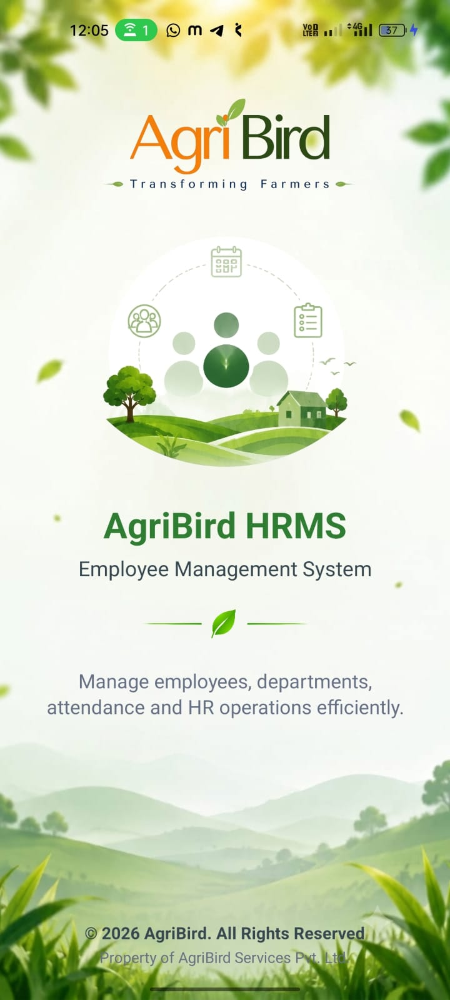
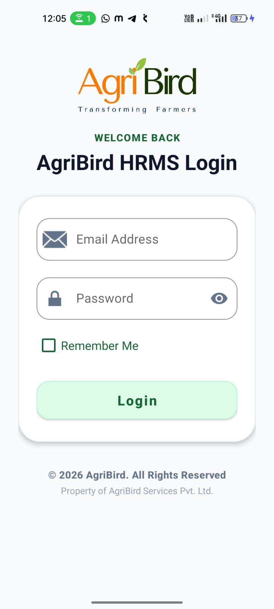
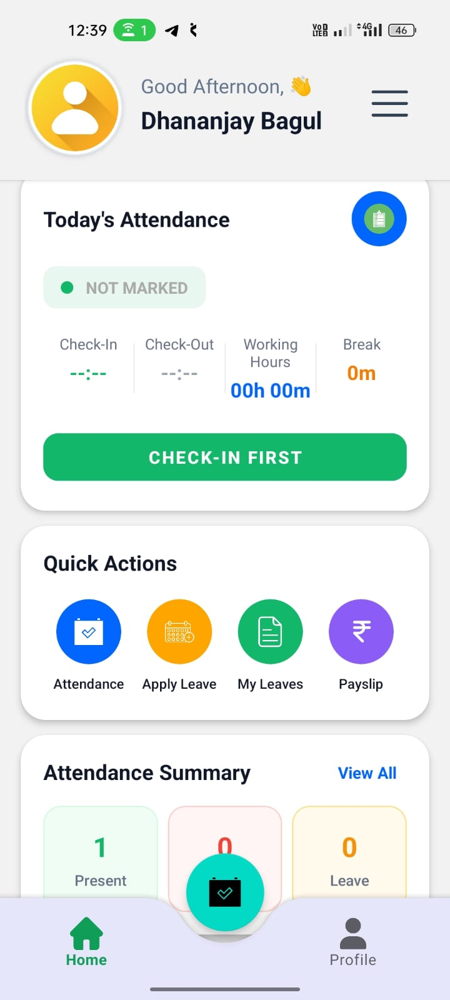
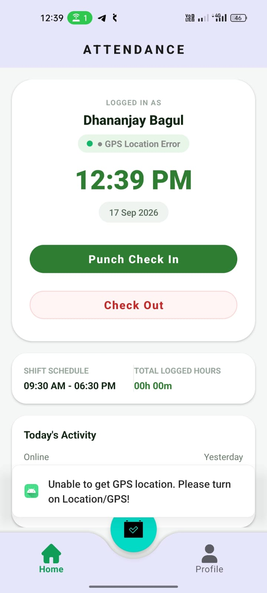
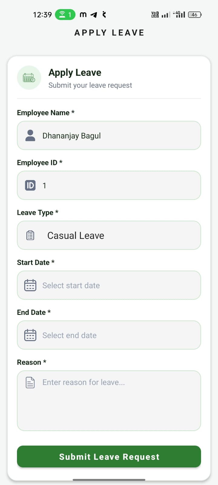
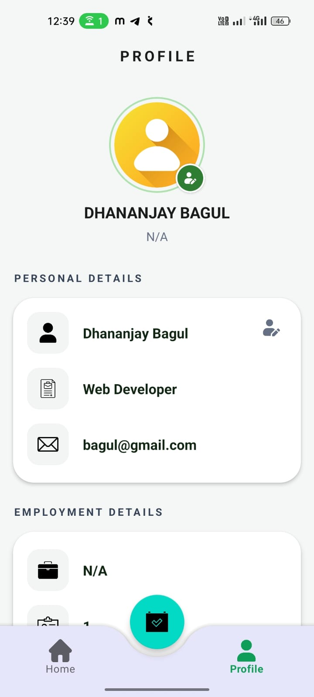

# 🌱 AgriBird HRMS

### Human Resource Management System — Android Application

AgriBird HRMS is an Android-based Human Resource Management System designed to simplify and manage essential employee and HR operations through a modern mobile application.

The application provides employees with features such as attendance management, leave management, employee profile, and other HR-related operations.

---

## 📱 About the Project

AgriBird HRMS is developed as an Android application for managing employee-related activities in a simple and user-friendly way.

The application provides a centralized mobile interface where employees can:

- 🔐 Login securely
- 🏠 View their HRMS dashboard
- ⏱️ Manage attendance
- 📍 Track attendance with GPS location
- 🏖️ Apply for leave
- 📋 View leave information
- 👤 View employee profile
- 📊 View attendance summary
- 💰 Access payslip information
- 🔔 Receive notifications

---

## ✨ Key Features

### 🔐 Authentication
- Employee login
- Password visibility option
- Remember Me option
- Secure API-based authentication

### 🏠 Dashboard
- Personalized employee dashboard
- Today's attendance status
- Attendance summary
- Quick actions
- Employee information

### ⏱️ Attendance Management
- Check-In
- Check-Out
- Working hours calculation
- Break tracking
- Shift schedule
- GPS location support
- Daily attendance activity

### 🏖️ Leave Management
- Apply for leave
- Select leave type
- Select start and end dates
- Enter leave reason
- View leave information

### 👤 Employee Profile
- Employee name
- Designation
- Email
- Employment details
- Profile information

---

## 🛠️ Technologies Used

- **Java**
- **Android**
- **XML**
- **Android SDK**
- **Retrofit**
- **REST API**
- **SQLite / Room Database**
- **RecyclerView**
- **ViewModel**
- **Repository Pattern**
- **Material UI Components**
- **GPS / Location Services**

---

## 🏗️ Project Structure

```text
AgriBirdHRMS/
│
├── app/
│   └── src/
│       └── main/
│           ├── java/
│           │   └── com/agribird/hrmsapp/
│           │
│           ├── res/
│           │   ├── drawable/
│           │   ├── layout/
│           │   ├── mipmap/
│           │   └── values/
│           │
│           └── AndroidManifest.xml
│
├── gradle/
├── screenshots/
│   ├── splash-screen.jpeg
│   ├── login.jpeg
│   ├── home-dashboard.jpeg
│   ├── attendance.jpeg
│   ├── apply-leave.jpeg
│   └── profile.jpeg
│
├── .gitignore
├── build.gradle
├── gradle.properties
├── gradlew
├── gradlew.bat
├── settings.gradle
└── README.md
```

---

# 📸 Screenshots

### 🌱 Splash Screen



---

### 🔐 Login Screen



---

### 🏠 Home Dashboard



---

### ⏱️ Attendance



---

### 🏖️ Apply Leave



---

### 👤 Employee Profile



---

## 🔌 Backend Integration

The Android application communicates with a REST API backend for employee and HR-related operations.

The Android application uses **Retrofit** for communication with the REST API.

> Backend REST API will be maintained in a separate repository.

---

## 🚀 Getting Started

### Prerequisites

- Android Studio
- Android SDK
- JDK
- Android Device or Emulator

### Installation

Clone the repository:

```bash
git clone https://github.com/baguldhananjay01/AgriBird-HRMS-Android.git
```

Open the project in **Android Studio**.

Allow Gradle to sync completely.

Connect an Android device or start an Android Emulator.

Run the application.

---

## 👨‍💻 Developer

**Dhananjay Bagul**

Android & Java Developer

---

## 📄 License

This project is developed for educational and professional project purposes.

---

### 🌱 AgriBird HRMS

**Simplifying Employee Management Through Technology.**